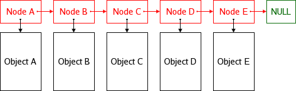

# Les classes

Il est demandé ici d'écrire des classes remplissant l'ensemble des exigences indiquées, puis de les tester par des appels pour prouver leur bon fonctionnement.

Les classes peuvent être déclarées et implémentées au dessus du `main` puis manipulées dans le `main`.

Les méthodes doivent être déclarées dans le corps de la classe, mais peuvent être implémentées à l'extérieur.

```c++
#include <iostream>
using namespace std;

class UneClasse { // Définition d'une classe
  private: // Membres privés
    // Quelques attributs
    int attribut;
    int attribut_avec_une_valeur_par_defaut = 0;
    string nom;
  public: // Membres publics
    // Une méthode déclarée _et_ implémentée dans le corps de la classe
    void afficher() {
      // this est un pointeur vers l'instance en cours...
      cout << this->nom << endl;
    }
    // Une méthode déclarée dans le corps de la classe...
    void une_methode(int avec_un_parametre);
    // Pas d'accolades, directement un point-virgule. Le corps de la méthode n'est pas ici.
};

// ... et implémentée à l'extérieur
void UneClasse::une_methode(int avec_un_parametre) {
  // Il y a une accolade, et donc un corps de méthode ici :)
  cout << "Une implémentation pertinente : " << avec_un_parametre << endl;
}

// Puis le main
int main(int argc, char **argv) {
  // Et on manipule tout ça
  UneClasse un_objet; // Instancier un objet
  UneClasse* un_pointeur_vers_un_objet = new UneClasse; // ...mode pointeur
  un_objet.une_methode(0); // Invocation de méthode
  un_pointeur_vers_un_objet->une_methode(1); // ...mode pointeur
  delete un_pointeur_vers_un_objet; // Tout ce qui a été new-é doit être delete-é
}
```

---
## Exercice 7.1
* Ecrire une classe `Rectangle` contenant :
  * 2 attributs de type `int` nommés `largeur` & `hauteur` en visibilité `private`
  * Les accesseurs et mutateurs pour les 2 attributs (getter/setter)
  * Une méthode `void Rectangle::afficher();` permettant de sortir sur la console les informations du `Rectangle` (`hauteur` et `largeur`).
  * Une méthode retournant la surface du rectangle.
  * Une méthode retournant le périmètre du rectangle.
* Instancier un `Rectangle` nommé `r1`, et lui renseigner une hauteur et une largeur.
* Instancier un autre `Rectangle` nommé `r2` par recopie de `r1`.
* Modifier `r1` et `afficher` les 2 rectangles.
* Déclarer un pointeur vers un `Rectangle` nommé `p1`.
* Instancier un `Rectangle` avec `new` puis en stocker l'adresse dans `p1`.
* Déclarer un nouveau pointeur vers un `Rectangle` nommé `p2` et lui affecter la valeur de `p1`.
* Modifier le `Rectangle` pointé par `p1` et `afficher` les cibles des 2 pointeurs.
* Libérer les allocations.

Aides :
* Utilisation du mot-clé [`class`](https://en.cppreference.com/w/cpp/keyword/class).
* [Délaration d'une classe](https://en.cppreference.com/w/cpp/language/class).
* Utilisation des mots-clés [`private` et `public`](https://en.cppreference.com/w/cpp/language/access).
* Instanciation d'[objet](https://en.cppreference.com/w/cpp/language/object).
* Utilisation du [constructeur de copie](https://en.cppreference.com/w/cpp/language/copy_constructor).
* Utilisation des [opérateurs d'accès aux membres d'une classe](https://en.cppreference.com/w/cpp/language/operator_member_access#Built-in_member_access_operators).
  * Pour une instance, le point : `instance.member();`
  * Pour un pointeur, la flèche : `pointeur->member();`
* Opérateur de réservation de mémoire : [`new`](https://en.cppreference.com/w/cpp/language/new).
* Opérateur de libération de mémoire : [`delete`](https://en.cppreference.com/w/cpp/language/delete).


---
## Exercice 7.2
* Ecrire une classe `Fichier` contenant :
  * Un constructeur public prenant un nom de fichier en paramètre.
  * Un destructeur faisant une sortie console de la `string` suivante : `"Aurevoir"`.
  * Une méthode `ecrire` prenant un `string` en paramètre representant le contenu à écrire.
    * La méthode écrit le contenu dans le fichier du nom passé en paramètre du constructeur.
  * Une méthode `lire` sortant sur la console le contenu du fichier du nom passé en paramètre du constructeur
* Instancier 2 objets de la classe `Fichier` pour :
  * Ecrire un contenu quelconque dans un fichier.
  * Lire et afficher dans la console le contenu de ce fichier.

Aides :
* Implémentation d'un [constructeur](https://en.cppreference.com/w/cpp/language/constructor) :
  * Une méthode sans type de retour nommée comme la classe.
* Implémentation d'un [destructeur](https://en.cppreference.com/w/cpp/language/destructor).
  * Une méthode sans type de retour nommée comme la classe préfixée de `~`.
* Manipulation des [`string`](https://en.cppreference.com/w/cpp/string/basic_string)
* Lecture de fichier avec [`ifstream`](https://en.cppreference.com/w/cpp/io/basic_ifstream) & [`ofstream`](https://en.cppreference.com/w/cpp/io/basic_ofstream) de la librairie [`fstream`](https://en.cppreference.com/w/cpp/header/fstream).


---
## Exercice 7.3
* Ecrire une classe `Point` contenant :
  * 2 entiers (x, y) représentant les coordonnées du point (avec leurs accesseurs / mutateurs).
  * Une méthode pour afficher le point.
  * 2 surcharges de l'opérateur `+` pour :
    * Additionner 2 points (un point en paramètre).
    * Additionner 1 point avec un incrément entier de coordonnées (un entier en paramètre).
* Instancier 2 points et définir leurs coordonnées.
* Afficher le point résultant de l'addition des 2 points.
* Afficher le point résultant de l'addition d'un point et d'un incrément entier.
* Faire la même chose avec des pointeurs :)

Aides :
* [Surcharge d'opérateur](https://en.cppreference.com/w/cpp/language/operators).


---
## Exercice 7.4
* Ecrire une classe implémentant une liste chaînée d'entier :<br/>

* La classe implémente les méthodes :
  * add : Ajouter un élément en fin de liste.
  * insert : Inserer un élément à une position donnée.
  * remove : Supprimer un élément de la liste.
  * count : Compter le nombre d'élément.
  * display : Afficher le contenu de la liste.

Aides :
* Utilisation du pointeur null : [`nullptr`](https://en.cppreference.com/w/cpp/language/nullptr)


---
## Exercice 7.5.a
* Ecrire une classe `Piece` implémentant une pièce d'échiquier.
* La `Piece` expose ces attributs mais ne permet pas ses modifications :
  * `x` et `y` : sa position sur l'échiquier.
  * `nom` : son nom.
* La `Piece` propose un seul constructeur prenant 3 paramètres : 2 pour sa position, et un pour son nom.
* La `Piece` fournit une méthode virtuelle permetttant de valider un déplacement :
  * La méthode prend 2 paramètres correspondant aux coordonnées d'arrivée souhaitées.
  * La méthode retourne un booléen indiquant si le déplacement est possible ou pas.
* La `Piece` fournit une méthode virtuelle permetttant de déplacer :
  * La méthode prend 2 paramètres correspondant aux coordonnées d'arrivée souhaitées.
  * La méthode retourne un booléen indiquant le succès du déplacement.
* Par défaut tout déplacement de `Piece` est autorisé.

Aides :
* Par défaut on protège les attributs :
  * En [`private`](https://en.cppreference.com/w/cpp/language/access) pour les rendre totalement inaccessibles de l'extérieur.
  * En [`protected`](https://en.cppreference.com/w/cpp/language/access) pour les rendre inaccessibles sauf à la descendance de la classe.
* "Exposer ses attributs" signifie les rendre disponibles à l'extérieur de l'objet.<br/>
Des attributs [`private`](https://en.cppreference.com/w/cpp/language/access) ou [`protected`](https://en.cppreference.com/w/cpp/language/access) peuvent être exposés avec un "getter" ou "accesseur".
* Une méthode [`virtual`](https://fr.cppreference.com/w/cpp/language/virtual) peut être redéfinie dans les classes héritières, et surtout sera dynamiquement invoquée.


## Exercice 7.5.b
* Ecrire une classe `Pion` spécialisant la classe `Piece` :
  * Le `nom` d'un `Pion` est toujours "Pion".
  * Les règles de déplacement d'un `Pion` sont simples : c'est toujours 1 case vers l'avant.<br/>
  On considérera que "aller en avant" équivaut simplement à augmenter `y`.
* Redéfinir les méthodes de validation et de déplacement de `Piece` en conséquence.
* Instancier en valider le bon fonctionnement du `Pion`.

Aides :
* Utilisation de la [dérivation de classe](https://en.cppreference.com/w/cpp/language/derived_class) : `class Enfant : public Parent { ... }`.


## Exercice 7.5.c
* Ecrire une classe `Fou` spécialisant la classe `Piece` :
  * Le `nom` d'un `Fou` est toujours "Fou".
  * Les règles de déplacement d'un `Fou` sont simples : en diagonal uniquement.
* Redéfinir les méthodes de validation et de déplacement de `Piece` en conséquence.
* Instancier en valider le bon fonctionnement du `Fou`.


---
## Exercice 7.6.a
* Ecrire une classe Combattant :
  * Avec les attributs suivants et leurs accesseurs (sans mutateurs) :
    * String : `nom` (le nom du combattant), `arme` (le nom de l'arme du combattant) (visibilité protected)
    * Entier non signé : `force`, `vitesse`, `defense` (les caractéristiques toute à 10 par défaut) (visibilité private)
    * Entier : `vie` (le niveau de vie du combattant) (visibilité private)
  * Un constructeur prenant les 3 caractéristiques en paramètre et interdisant une somme de caractéristique supérieure à 30
  * Avec les méthodes suivantes :
    * `attaquer` prenant en paramètre un Combattant et infligeant les dégâts à l'adversaire.
    * `subir` prenant en paramètre un nombre de dégât et affectant la `vie` avec une formule basée sur les dégâts reçus et la `vie -= defense` : `(degats * (100 - defense) / 100)`.


## Exercice 7.6.b
* Ecrire 2 classes spécialisant le `Combattant` :
  * `Chevalier` :
    * `nom` = Chevalier
    * `arme` = Epée
    * Caractéristiques : `force` = 15, `vitesse` = 0, `defense` = 15
  * `Ninja` :
    * `nom` = Ninja
    * `arme` = Poignard
    * Caractéristiques : `force` = 15, `vitesse` = 15, `defense` = 0


## Exercice 7.6.c
* Ecrire une classe `Arene` :
  * Permettant à 2 `Combattant`s de rentrer dans l'`Arene` (une méthode `entrer`).
  * Permettant de dérouler le combat jusqu'à la défaite d'un des `Combattant`s :
    * Le premier `Combattant` à attaquer est le plus rapide.
    * Le combat s'arrête dès qu'un `Combattant` a sa `vie` qui tombe à zéro (ou en dessous).
    * Le combat se termine par l'annonce du vainqueur.
* Faire combattre des `Combattant`s.<br/>
Le `Chevalier` contre le `Ninja` (et constater la victoire du `Chevalier`).


## Exercice 7.6.d
* Tenter de faire gagner le `Ninja` sans changer ses caractéristiques :
  * En trichant !

Aides :
  * Redéfinition de méthode dans la classe du tricheur.
